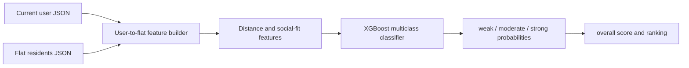

```mermaid
flowchart LR
    A[Current user JSON] --> C[User-to-flat feature builder]
    B[Flat residents JSON] --> C
    C --> D[Distance and social-fit features]
    D --> E[XGBoost multiclass classifier]
    E --> F[weak / moderate / strong probabilities]
    F --> G[overall score and ranking]
```